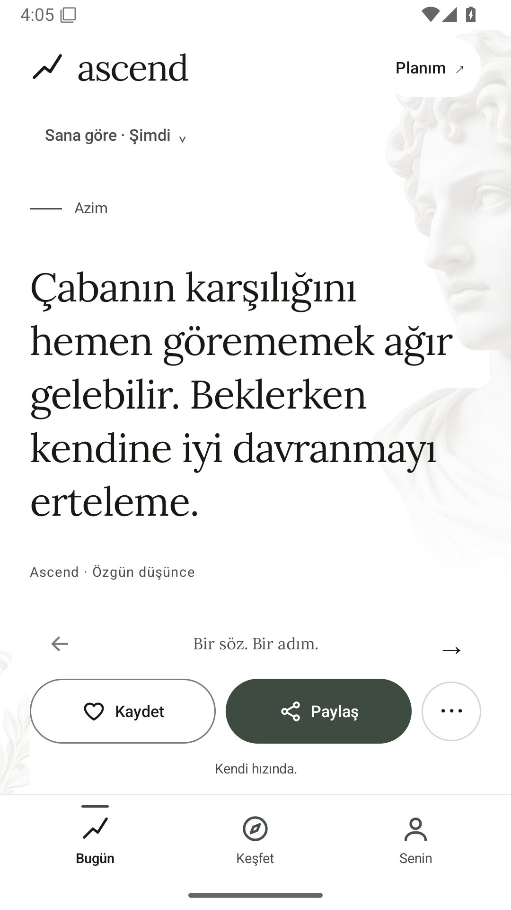
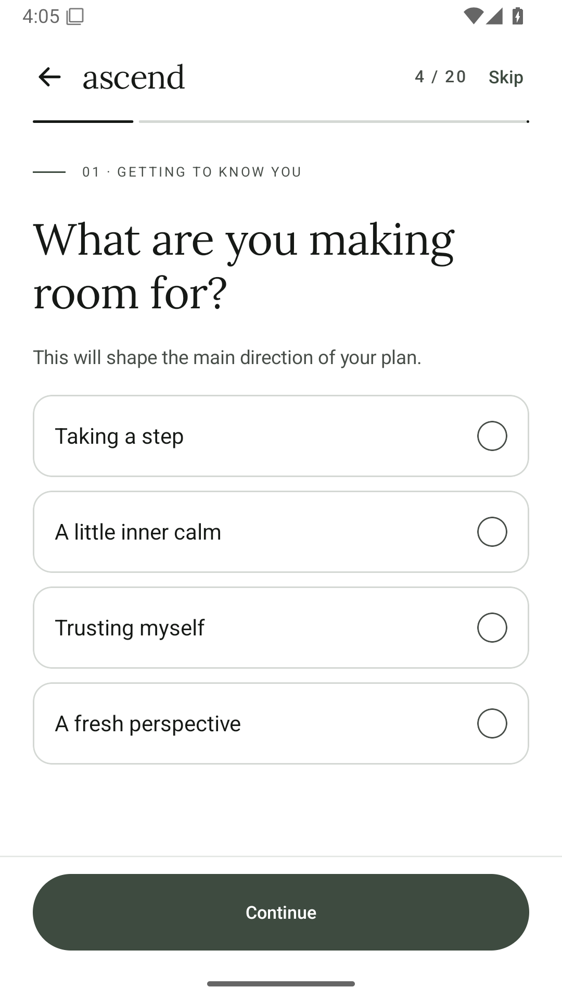
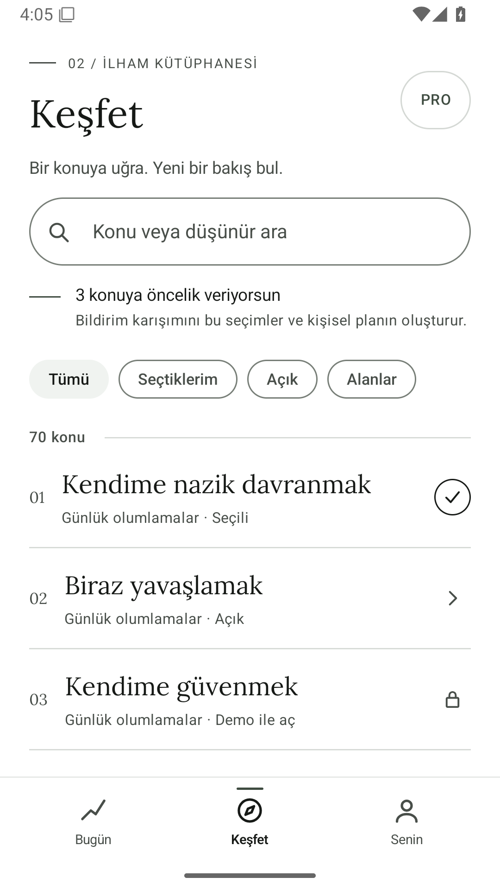

# Ascend

Motivasyon, olumlama, azim, odak ve felsefeden özgün düşünceleri gününe taşıyan Android uygulaması. Kotlin, Jetpack Compose ve Material 3 ile geliştirilmiştir.

## 8.2 — Bordo ve mermer kütüphane

Kullanıcının tasarım raporuna göre Keşfet, gerçek koleksiyonlar ve sade konu listeleri etrafında yeniden düzenlendi. Ortak bordo başlıklar, dengelenmiş ana ekran eylemleri ve 20 adımın tamamında tutarlı onboarding dili kullanılır.

- **Koleksiyonlar / Tüm konular / Seçtiklerim:** Genel Türkçe arama, bağımsız erişim filtreleri, kaydırma ve geri dönüş durumunun korunması.
- **Konuya göz atmak seçim değildir:** Açık konu tüm sözlerini gösterir; kilitli konu iki sözlük önizlemeyi korur. Bildirim seçimi açık bir anahtarla yapılır.
- **Açık okuma yüzeyi:** Tek büst, eş ağırlıklı Kaydet/Paylaş, doğru anlamlı “Sana göre”, bordo aktif navigasyon.
- **Onboarding:** Tek sütun motifi, bordo seçim durumu, taşmadan akan plan konu etiketleri, kalan erişim/izin adımlarının açıklaması.
- İçerik kimlikleri, İngilizce ana katalog, 3 ücretsiz paylaşım arka planı, mevcut erişimler ve ödeme almayan demo aynı kalır.

[Madde madde uygulama ve doğrulama raporu](docs/20-ASCEND-8.2-TASARIM-UYGULAMA.md)

## 8.1 yenilikleri

- Kategori, söz ve kaynak tek bir okuma bütünü: daha dengeli boşluklar ve metin uzunluğuna uyarlanan serif dizgi.
- Ana ekranda tek slogan, sade söz sayacı ve tek heykel motifi.
- Keşfet'te kısa başlık, daha erken başlayan ince kategori listesi ve çerçevesiz filtreler.
- Her satır kategori içeriğine gider; bildirim seçimi kategori içindeki ayrı anahtarla yapılır. Demo erişimi kazanmak artık kendiliğinden bildirim seçmez.
- Beyaz/siyah temelde sınırlı bordo vurgular; bordo zemin üzerinde yaprak sarılı Roma sütunu ikonu.

[Estetik değerlendirme ve uygulanan kararlar](docs/19-ASCEND-8.1-ESTETIK-DUZENLEME.md) · [İkon üretim kaydı](content/launcher-v81-provenance.json)

## 8.0 tasarım temeli

- **Mermer ve mürekkep:** beyaz zemin, siyah serif yazılar, ince konturlar ve soluk Roma büstü, sütun ve kemer ayrıntıları.
- Ana ekran, 20 adımlı onboarding, Keşfet, Senin, kişisel plan, Kaydedilenler, ayarlar, Pro ve paylaşım stüdyosu aynı tasarım diliyle yenilendi.
- Yeni kurulumda aydınlık Mermer; Mürekkep/Bordo ve nötr gece seçenekleri. Eski sıcak/mavi arayüz paletleri güvenli biçimde taşınır; duvar kâğıdı renkleri görünümü değiştirmez.
- Ana işlemler kaydırmadan erişilir. Yüzde 200 yazıda uzun söz kendi alanında kayar; kontroller ve üç sekme görünür kalır.
- 700 İngilizce kaynak metin, bağlı Türkçe çeviriler, 70 kategori, 107 paylaşım arka planı ve mevcut haklar korunur.

<p>



</p>

[Tasarım araştırması ve mimari kararlar](docs/17-ASCEND-8-TASARIM-ARASTIRMASI.md) · [Doğrulama kaydı](docs/18-ASCEND-8-DOGRULAMA.md)

## Korunan ürün özellikleri

- Yükselen çizgiyle kurulan siyah/beyaz kimlik, sade ana ekran ve **Bugün / Keşfet / Senin** olmak üzere üç ana bölüm.
- **20 ekranlık kişisel başlangıç:** 13 tercih sorusu, isteğe bağlı isim, bildirim düzeni, kişisel plan, erişim açıklaması ve izin adımı. Sorular atlanabilir; ilerleme kaydedilir ve plan sonradan düzenlenebilir. Hızlı başlangıç da sunulur.
- Yanıtlar içerik biçimini, konu ağırlıklarını, uzunluk sıralamasını ve keşif tercihlerini belirler. Oluşan plan hem ana akışı hem hatırlatmaları besler; istenmeyen konular ve manevi içerik tercihi gözetilir.
- Ana ekranın temel eylemleri kaydırmadan erişilebilir. Anlık ihtiyaç seçimi yalnız o anki akışı değiştirir; bildirim planı ayrı yönetilir.
- Fotoğraf kalabalığı olmadan taranan **70 ayrı kategori**, kategori başına 10 özgün söz; seçili bildirim konuları kişisel plan ve Keşfet üzerinden görülebilir.
- Günlük 1–7 hatırlatma, başlangıç/bitiş saatleri ve yaklaşık gönderim saatlerinin önizlemesi.
- Ayrıntılı Android bildirim izni, Samsung görünüm rehberi, kanal ayarı ve deneme bildirimi.
- Görseller paylaşım stüdyosunda: önceki 37 arka plana eklenen 70 kategori görseliyle **107 hazır arka plan**. Dağ, doğa, kale, şövalye, cadı ve dokulu renkler; koleksiyon araması ve görsel önizleme.
- Paylaşımda **Zirve, Gece ve Kâğıt** ücretsiz. Diğer arka planlar, fotoğraf, biçim/yazı düzenleme ve 5/10/30/45 saniyelik video Pro.
- **Pro demosu** tüm kategorileri ve paylaşım araçlarını açar. Ödeme alınmaz ve abonelik başlatılmaz. Demo kapatılabilir; bildirim konuları kullanıcı seçimine bağlıdır.
- Yeni kurulumda 6 ücretsiz kategori. Geçici reklam demosu Google.com'u açar; dönüşte yalnız seçilen kategori açılır. Gerçek reklam bağlı değildir.
- Önceki kullanıcıların açık kategorileri, kaydedilmiş sözleri ve geçmişi uygulama içi geçişte korunur.

## APK ve doğrulama

**[Ascend 8.2 test APK’sını indir](https://github.com/yalnizfahrettin06-tech/Ascend/releases/download/v8.2.0-preview.1/Ascend-8.2.0-test.apk)**

[Güncel bulut çalışmaları](https://github.com/yalnizfahrettin06-tech/Ascend/actions/workflows/android.yml) içinde **Artifacts → Ascend-8.2.0-test-APK** bulunur. Son tasarım raporundaki yazı boyutu ve ekran karşılaştırmaları aynı bulut çalışmasında üretilir. Sonuçlar uygulama raporunda kaydedilir.

Önceki sürüm: [Ascend 8.0 test APK’sı](https://github.com/yalnizfahrettin06-tech/Ascend/releases/tag/v8.0.0-preview.1). O sürümün 68 birim ve 42 Android testi: [8.0 doğrulama](docs/18-ASCEND-8-DOGRULAMA.md).

Önceki sürüm: [Ascend 7.0 test APK’sı](https://github.com/yalnizfahrettin06-tech/Ascend/releases/tag/v7.0.0-preview.1). O sürümün 64 birim ve 37 Android testi: [7.0 doğrulama](docs/16-ASCEND-7-DOGRULAMA.md).

Önceki sürüm: [Ascend 6.0 test APK’sı](https://github.com/yalnizfahrettin06-tech/Ascend/releases/tag/v6.0.0-preview.1) (`Ascend-6.0.0-test.apk`). 6.0 için kaydedilen 48 JVM ve 26 Android testi sonucu yalnız o sürüme aittir: [doğrulama](docs/13-ASCEND-6-TEST-PLANI.md) · [ekranlar](docs/14-ASCEND-6-EKRANLAR.md).

APK geliştirme imzalı test sürümüdür; mağazaya yükleme paketi değildir. Paket adı `.debug` ile bittiği için eski Azim ile yan yana kurulabilir. Farklı Actions çalışmaları farklı geliştirme imzaları oluşturabilir. Güncelleme imza hatası verirse eski test sürümünün kaldırılması gerekir ve o test sürümünün verileri silinir. Kalıcı güncelleme için sabit imzalama anahtarı gerekir.

## İngilizce ana kaynak

- [Tek İngilizce kaynak](content/source.en.json): 700 özgün metin ve sabit kimlikler.
- [Türkçe çeviri](content/translations/tr.json) ve [English translation guide](content/README.md).
- İngilizce değiştiğinde gözden geçirilmemiş çeviriyi durduran kaynak parmak izi kontrolü.
- Uygulama dilleri Türkçe ve İngilizce; diğer diller henüz entegre edilmedi.
- Felsefe ve inanç metinleri özgün düşünceler olarak etiketlenir; kişilere veya kutsal metinlere uydurma atıf yapılmaz.
- Eski kaydedilmiş sözler ayrı arşivden çözülür; yeni akış ve bildirimler yeni katalogdan beslenir.

## Raporlar

- [8.1 estetik düzenleme ve kararlar](docs/19-ASCEND-8.1-ESTETIK-DUZENLEME.md)
- [8.0 ayrıntılı tasarım araştırması](docs/17-ASCEND-8-TASARIM-ARASTIRMASI.md)
- [8.0 doğrulama ve APK kaydı](docs/18-ASCEND-8-DOGRULAMA.md)
- [Klasik dekor üretim kaydı](content/classical-art-provenance.json)
- [7.0 rakip araştırması, kişisel başlangıç ve tasarım kararları](docs/15-ASCEND-7-ARASTIRMA-VE-TASARIM.md)
- [7.0 doğrulama kaydı ve sınırlar](docs/16-ASCEND-7-DOGRULAMA.md)
- [6.0 UI/UX, kategori ve erişim araştırması](docs/12-ASCEND-6-UI-UX-VE-ERISIM.md)
- [6.0 doğrulama ve kabul planı](docs/13-ASCEND-6-TEST-PLANI.md)
- [Kategori görselleri ve üretim kaydı](docs/category-art.json)
- [Yeni sahnelerin üretim kaydı](docs/scene-art.json)
- [5.0 içerik araştırması](docs/09-ASCEND-5-ICERIK-RAPORU.md)

01–18 numaralı belgeler önceki sürümlerin tarihsel kayıtlarıdır.

## Geliştirme

JDK 17 ve Android SDK 35:

```sh
python tools/icerik_derle.py --check
python tools/check_category_art.py
bash gradlew :app:assembleDebug :app:testDebugUnitTest :app:lintDebug --max-workers=2
bash gradlew :app:connectedDebugAndroidTest --max-workers=2
```

Sürüm imzası için `ASCEND_KEYSTORE_PATH`, `ASCEND_STORE_PASSWORD`, `ASCEND_KEY_ALIAS`, `ASCEND_KEY_PASSWORD` kullanılır. İmza yokken release çıktısı imzasızdır. Tokenlar ve imzalama anahtarları depoya eklenmez. Uygulama kimliği ve DataStore anahtarları uyumluluk için korunur.

## Actions kullanımı

Public depolarda standart GitHub sunucularında çalışma ücretsizdir. Büyük sunucular ücretlidir; artifact ve önbellek için ayrı saklama sınırları bulunur. Akış standart `ubuntu-latest`, 25 dakikalık iş zaman aşımı, 7 günlük çıktı saklama ve aynı dal için eski çalışmayı iptal etme kullanır. [GitHub ücretlendirme belgesi](https://docs.github.com/en/billing/concepts/product-billing/github-actions).
