# Ascend — Gerçek Android ekran görüntüleri

Kaynak: [başarılı GitHub Actions çalışması](https://github.com/yalnizfahrettin06-tech/Ascend/actions/runs/34156282949). Android 15 / API 35, Pixel 2 profili, 1080×1920. Görüntüler maket değildir. İlk dokuz görüntü gerçek MainActivity akışından; son ikisi 2× yazı ölçeğinde yalıtılmış onboarding kontrolünden alınmıştır.

Kaydırılabilir içerikte ekran altından devam eden metinler bulunur. Özellikle büyük yazıda bütün içeriğin tek görüntüye sığması beklenmez; alt eylemlerin erişilebilir kalması test edilmiştir. Paket içinde alınan ilk yalıtılmış karşılama görüntüsü ilk çizimden önce yakalandığı için boştu; bu galeriye alınmadı. Gerçek uygulama karşılama ekranı aşağıda doğrulanmıştır.

## Karşılama

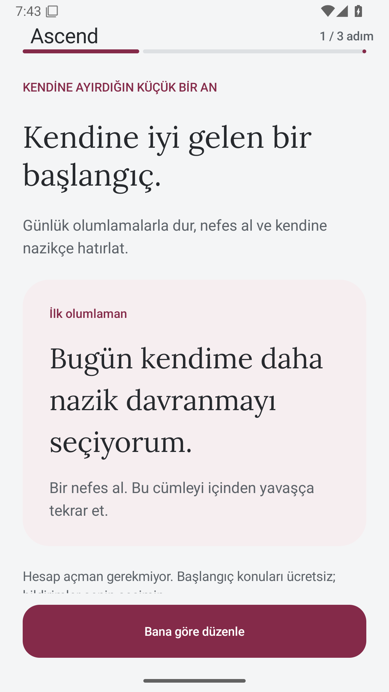

## İhtiyaç seçimi

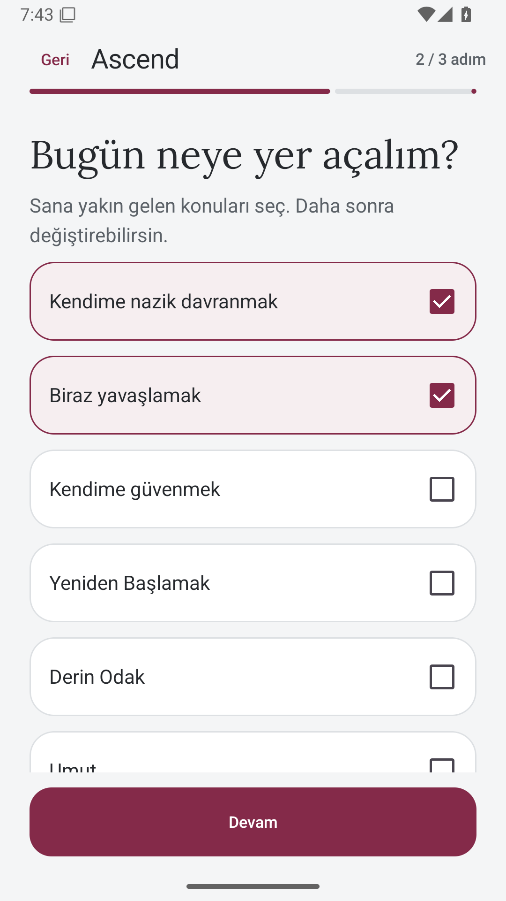

## İsteğe bağlı hatırlatıcı

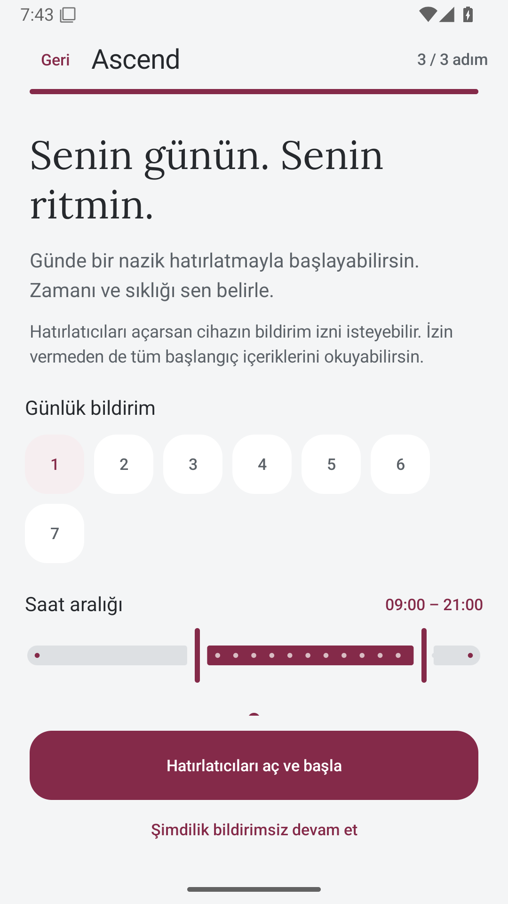

## Bugün

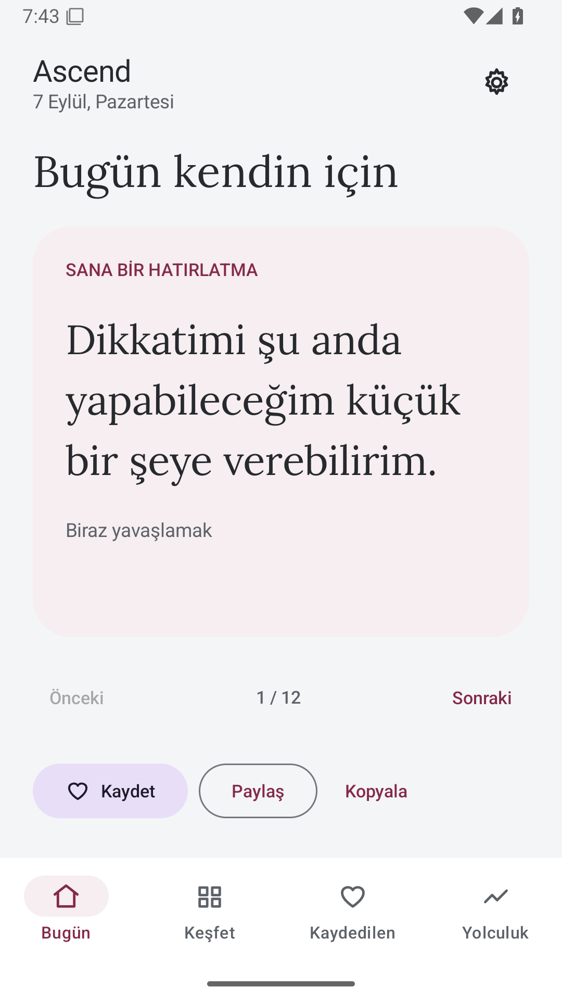

## Kaydedilenler

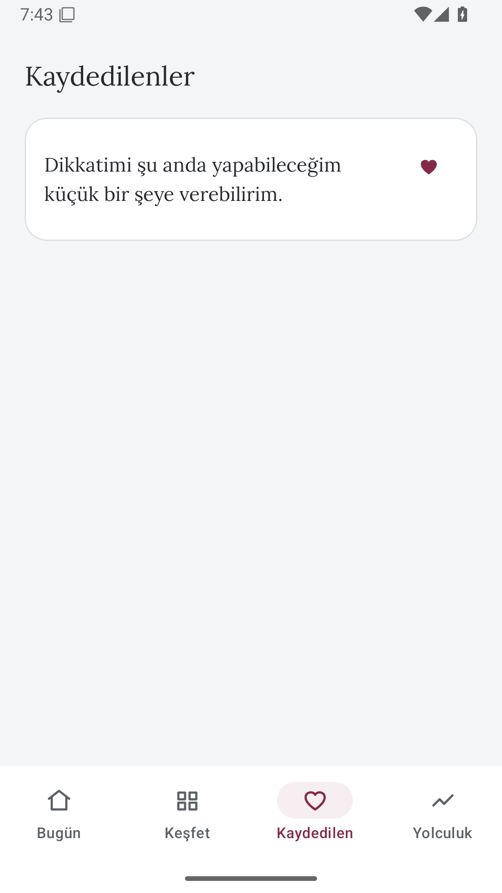

## Keşfet

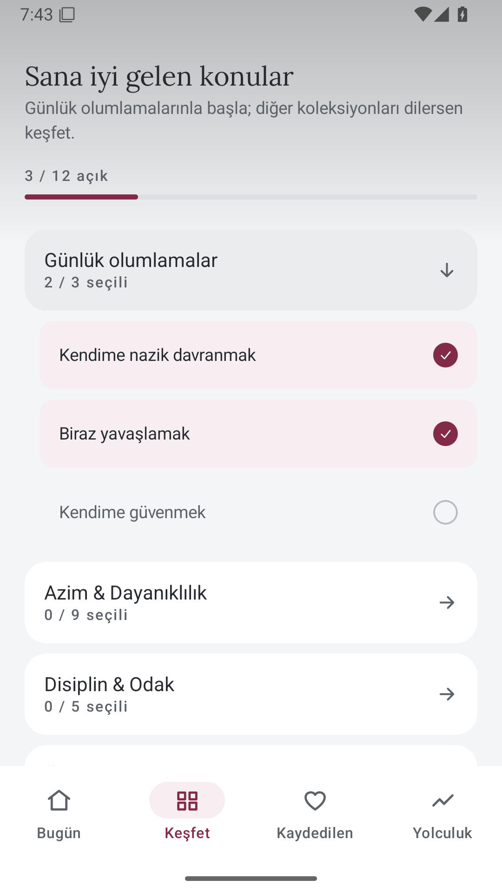

## Yolculuk

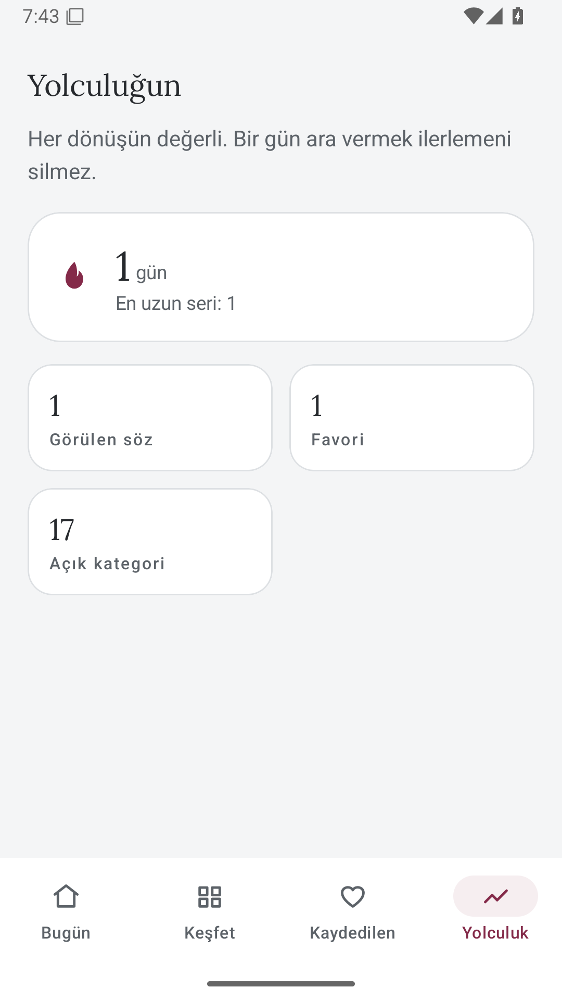

## Ayarlar — Türkçe

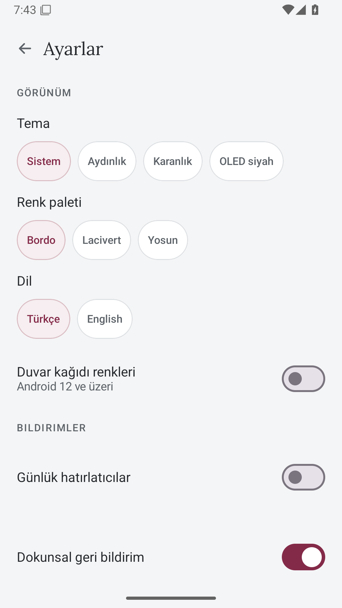

## Ayarlar — English

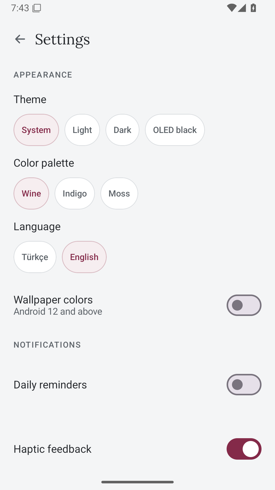

## 2× yazı — koyu tema karşılama

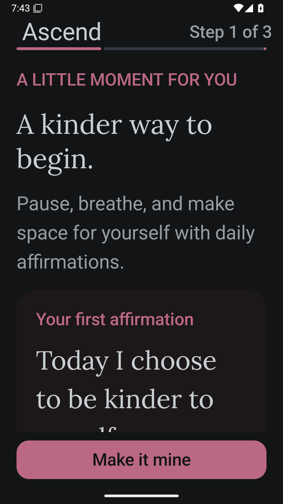

## 2× yazı — bildirimsiz devam

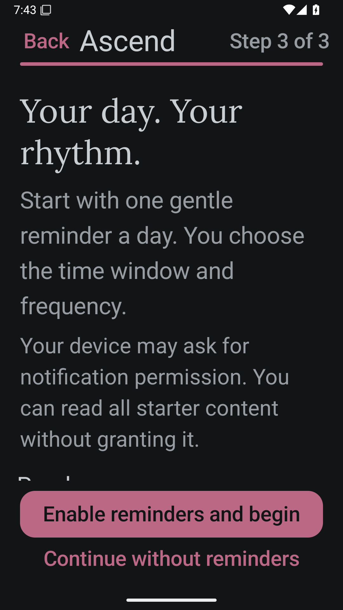
