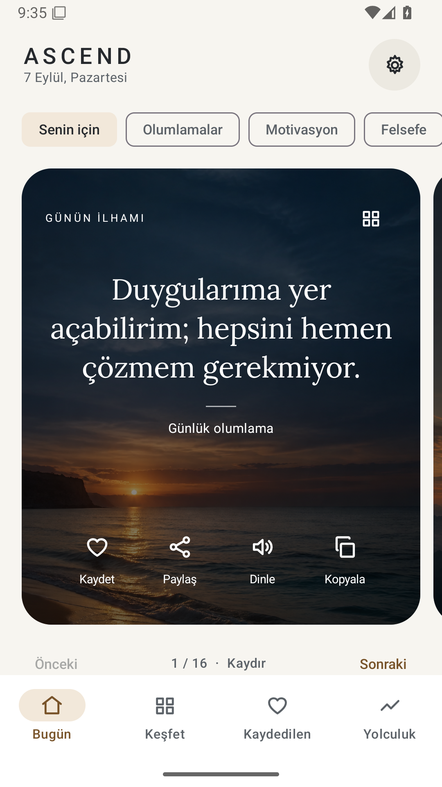
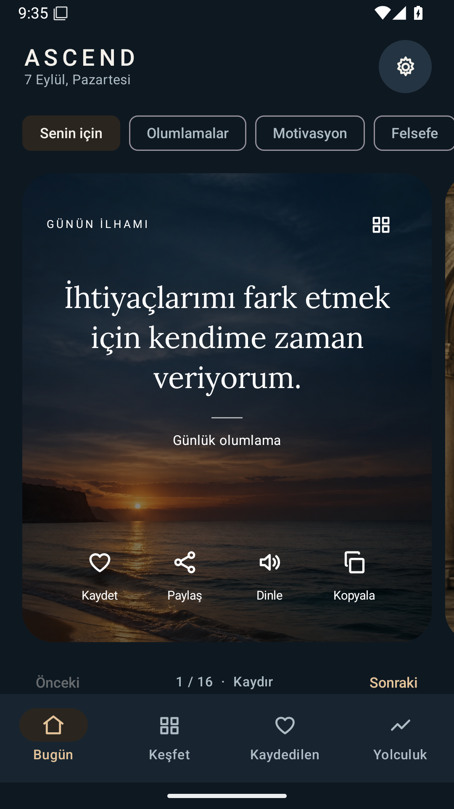
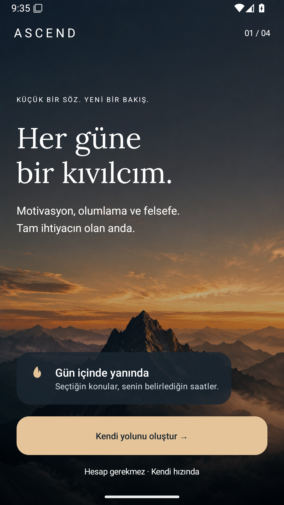
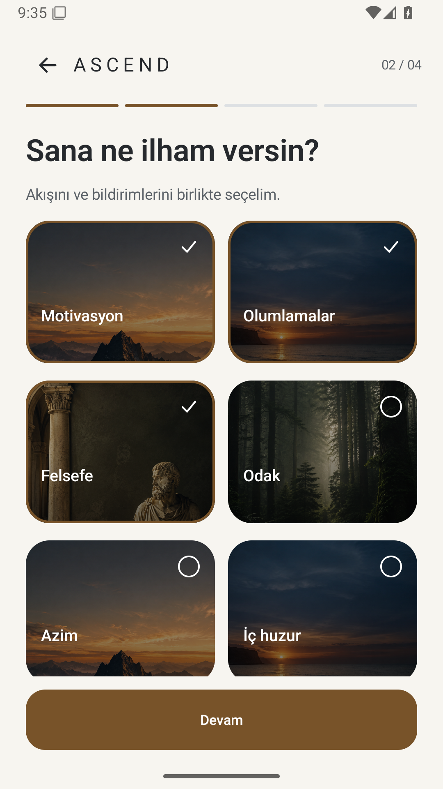
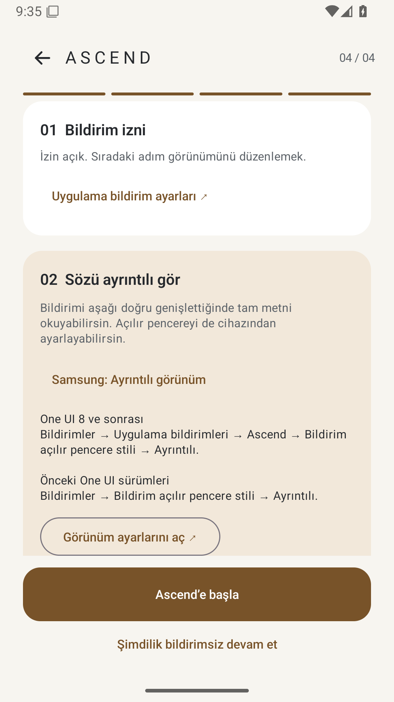
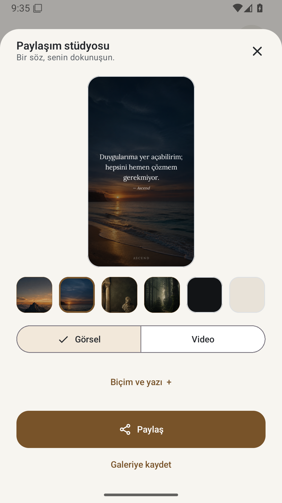
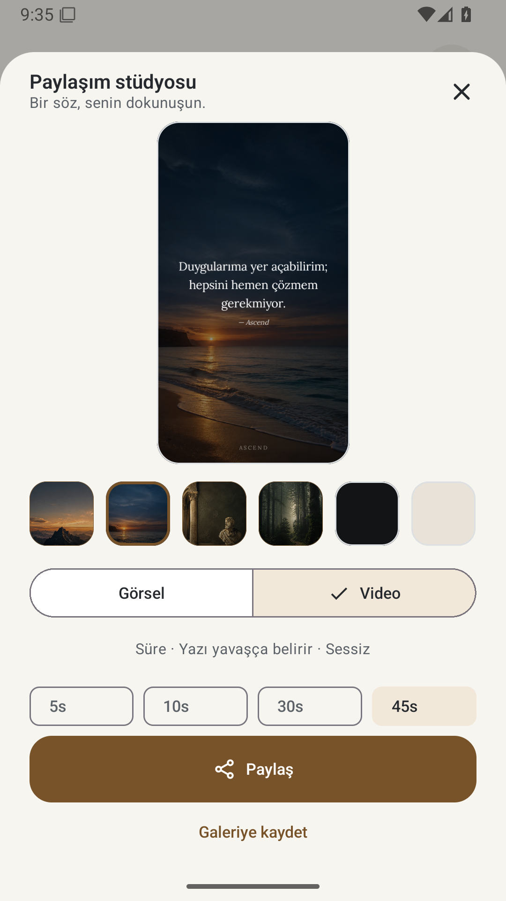
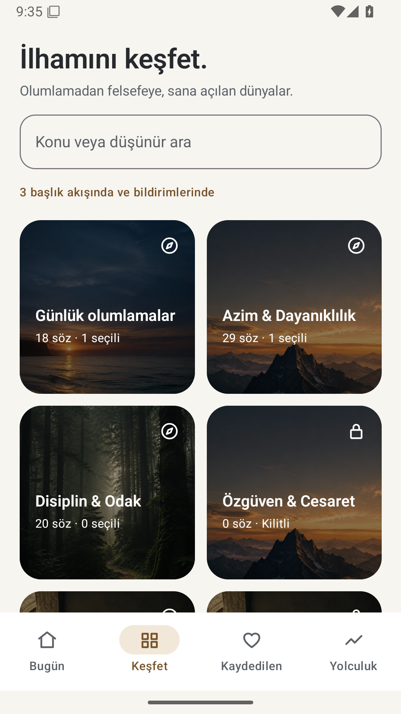

# Ascend 4.0 — Gerçek uygulama ekranları

Android 15 emülatöründe çalışan uygulamadan alındı. [Doğrulama sonuçları](07-ASCEND-4-DOGRULAMA.md).

| Ana ekran | Koyu tema |
|---|---|
|  |  |

## Karşılama

## İlham konuları

## Ayrıntılı bildirim rehberi

## Görsel paylaşımı

## Video ve süre

## Koleksiyonlar

