# Ascend 6 — Gerçek uygulama ekranları

Test edilen kod: `b8d2d6ff6621ee896d1d03c4101aeae9dcaedc8b`. [Actions çalışması](https://github.com/yalnizfahrettin06-tech/Ascend/actions/runs/34229375936). Bunlar API 35 emülatöründe uygulamanın çalışırken alınan görüntüleridir.

## Karşılama

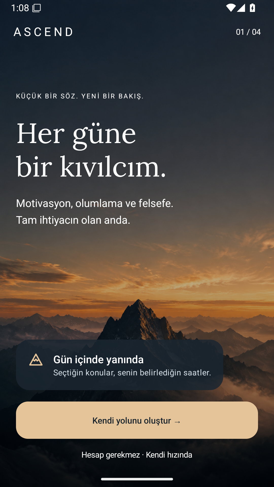

## Bildirim konuları

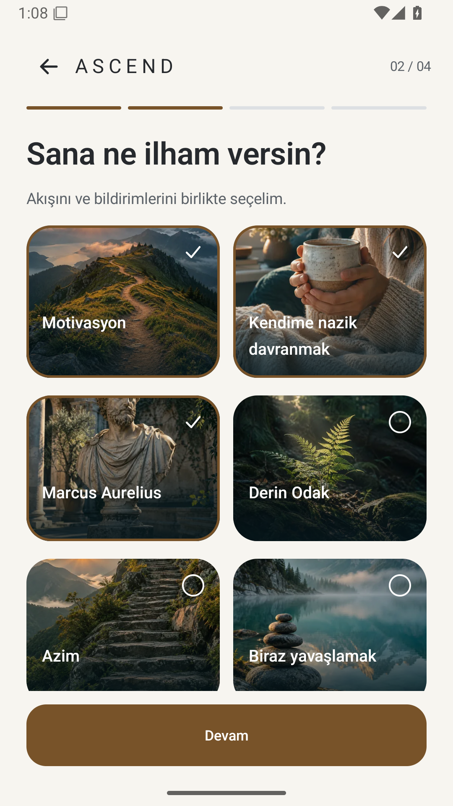

## Yeni bildirim planı

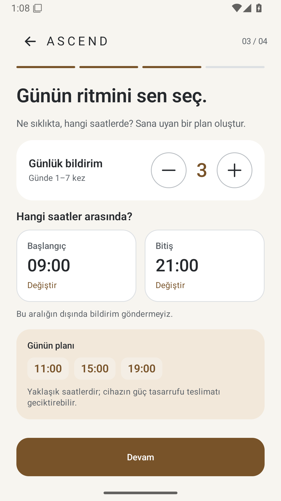

## Bildirim izni

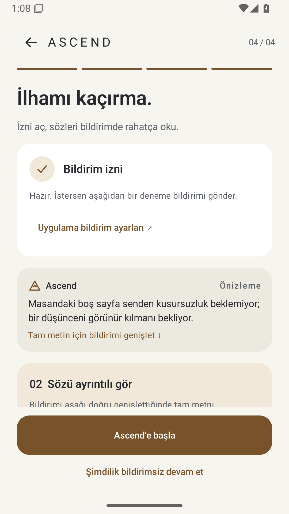

## Görselli ana ekran

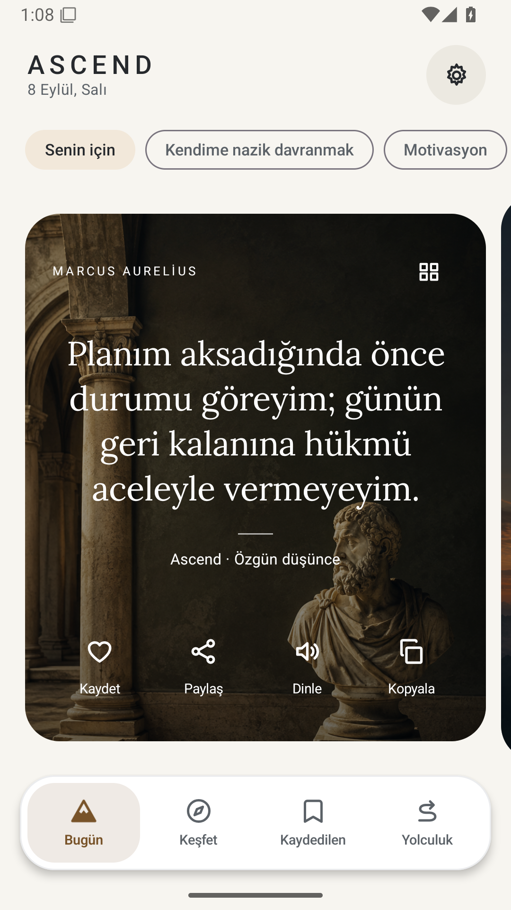

## Bağımsız kategoriler

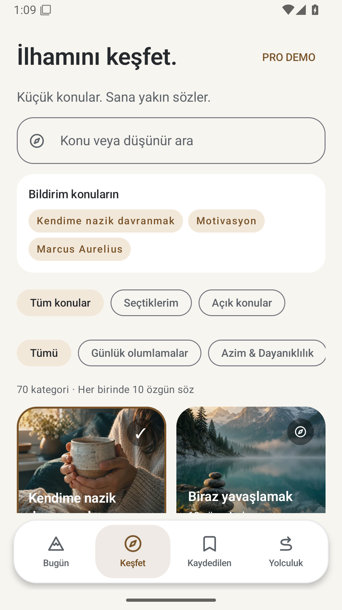

## Yolculuk

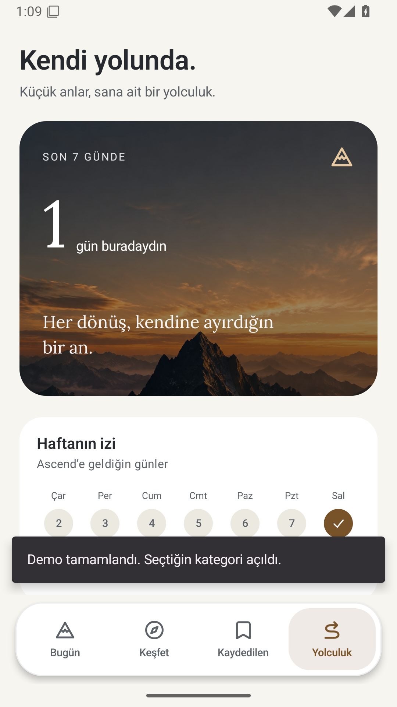

## Açıkça belirtilen Pro demosu

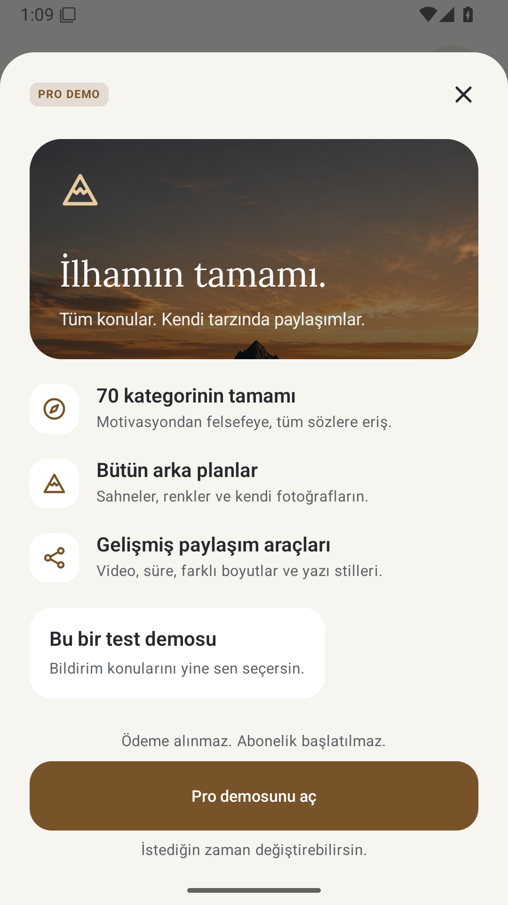

## Tek kategori ve iki örnek söz

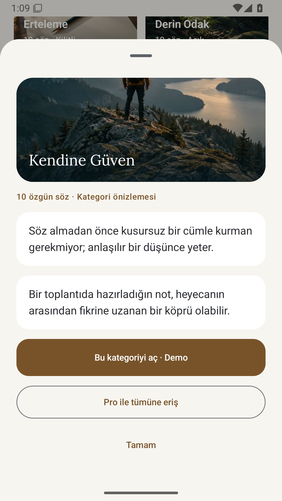

## Dokulu arka planlar

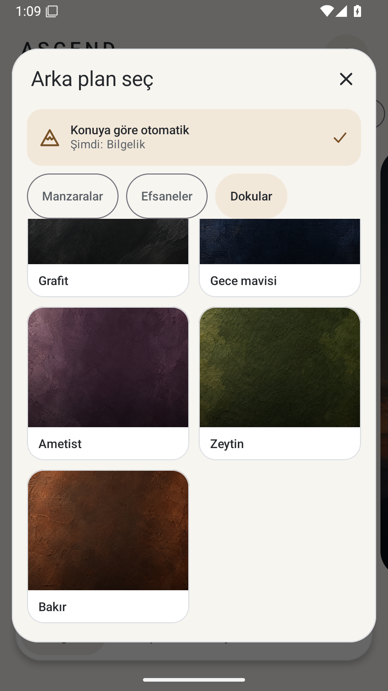

## Bakır dokulu ana ekran

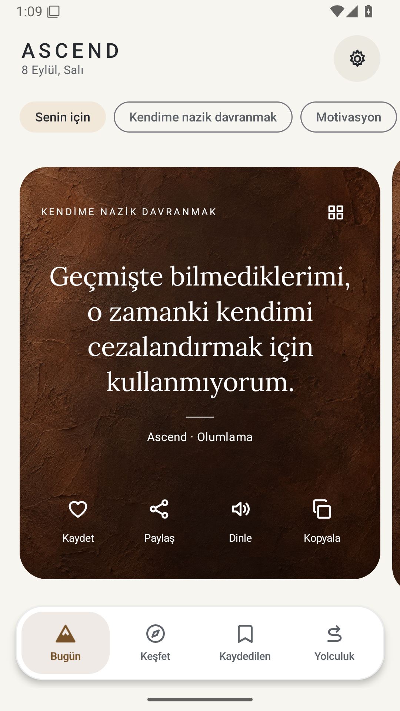

## Şövalye ile paylaşım

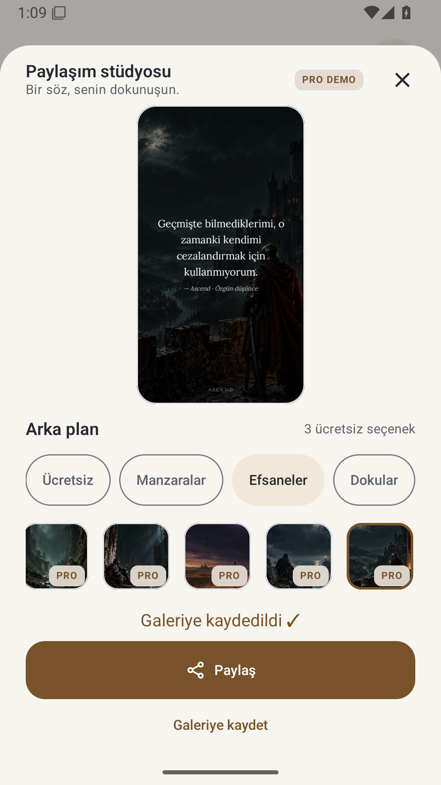

## 320 dp ve 2× yazı: ana ekran

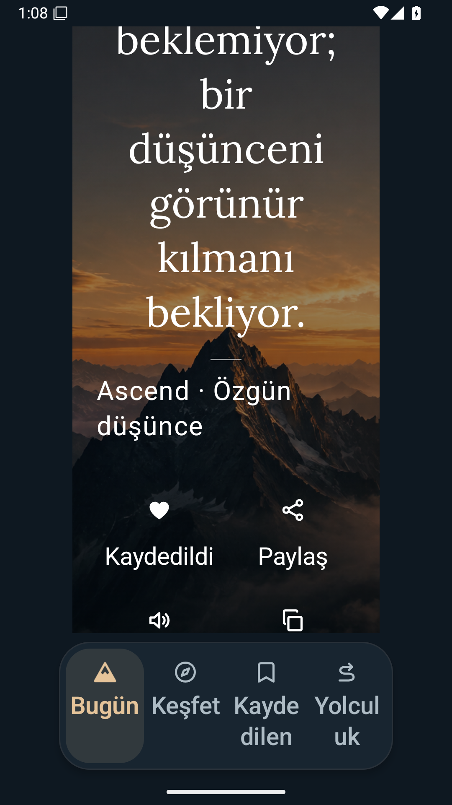

## 320 dp ve 2× yazı: Yolculuk

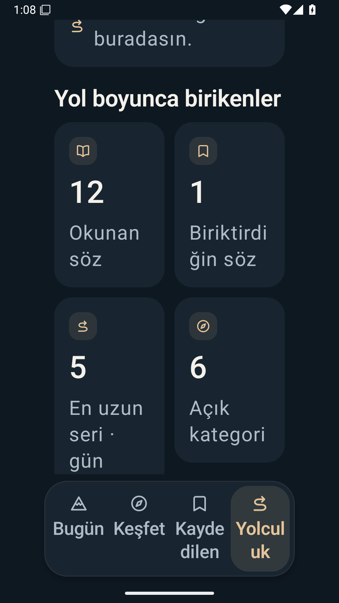
